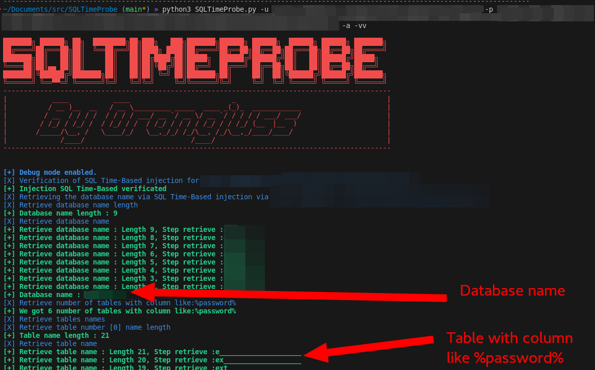

# SQLTimeProbe - A little script to exploit Time-Based SQL Injection

SQLTimeProbe is a simple Python script designed to exploit Time-Based SQL Injection vulnerabilities.


## Description

Time-Based SQL Injection is a type of SQL Injection attack that relies on the database management system's (DBMS) time delays to infer information about the database. This script automates the process of exploiting Time-Based SQL Injection vulnerabilities, making it easier to test and secure web applications.

## Features

- Automated Time-Based SQL Injection exploitation
- Easy to use with a simple command-line interface
- Retrieve database name and table with column like [...]

## Usage

1. Clone the repository:

```bash
git clone https://github.com/Orangiuss/SQLTimeProbe.git
```

2. Navigate to the SQLTimeProbe directory:
```bash
cd SQLTimeProbe
```

3. And enjoy ;) :
```
python sqltimeprobe.py -u <target_url> -p <params_with_fuzz> [-a | --attack] [-V | --verify] [-vv]
```

### Example :
```
python sqltimeprobe.py -u http://example.com -p "test=<@urlencode>OK' AND (SELECT 6222 FROM (FUZZ)Nhou) AND 'VRpn'='VRpn<@/urlencode> [-a | --attack] [-V | --verify] [-vv]
```

### Image example :
